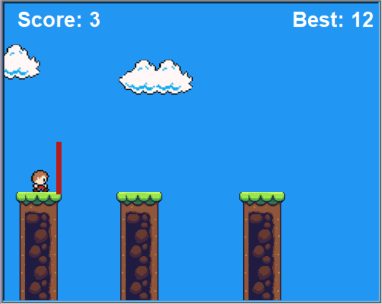

# Bridge Hero 

**Bridge Hero** is a simple arcade game created using [Turtle Graphics](https://docs.python.org/3/library/turtle.html). The code is written as clearly as possible for beginners to easily understand the concepts and apply in their own projects.

### Description

In **Bridge Hero**, the players must use their building skills to construct bridges and advance to the next platform. The objective is to carefully construct a bridge that will safely allow little *Bob* to cross over the gaps. 

### Features

 - Endless gameplay
 - Random level generation
 - Simple, intuitive control
 - Fun, colorful design 

### Gameplay

 - Press "S" to start/restart the game
 - To build the bridges, press down "SPACE"
 - If the bridge reaches the desired length, release "SPACE"
 - The bridge will fall flat on the ground
 - And the character will walk across it

### Screenshots

### License

This game sources are licensed under MIT. Check [LICENSE](LICENSE) for further details.
